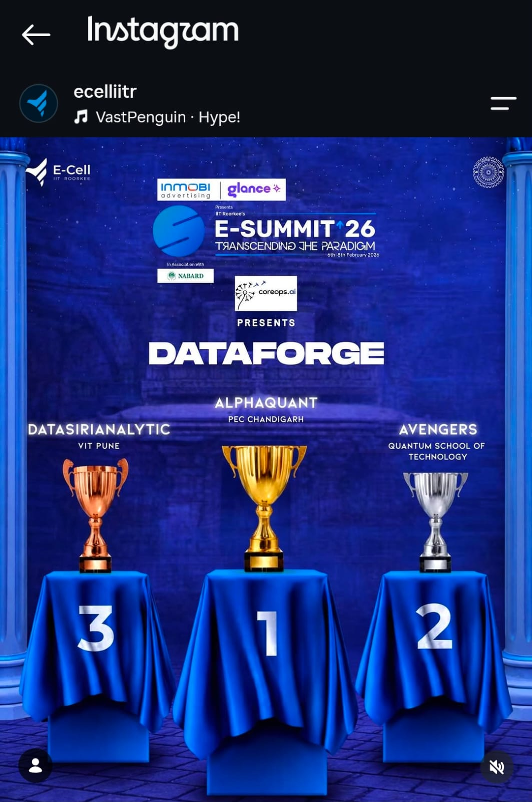
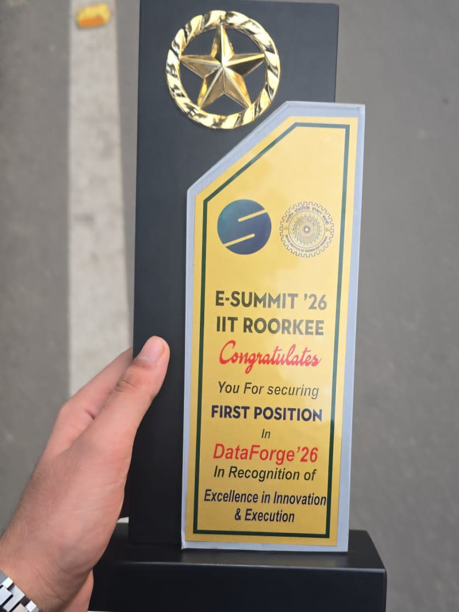
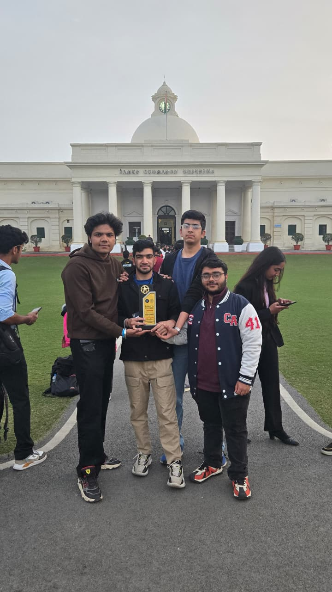

<div align="center">
  <h1>🏆 IIT Roorkee DataForge Hackathon - 1st Place Winners!</h1>
  
  <p><strong>Team Alphaquant</strong></p>
  
  <p>After qualifying several intense online rounds, our team advanced to the finals of the <strong>IIT Roorkee DataForge Hackathon</strong>, conducted by <strong>CoreOps.ai</strong> at the <strong>IITR E-Summit</strong>. We are incredibly proud to share that we secured the <strong>First Position</strong> overall!</p>

  
  
  
  <br>
  
  <a href="https://www.linkedin.com/posts/aditya-gupta-548a421a4_hackathon-winner-ai-activity-7426857005342081024-DBnY?utm_source=share&utm_medium=member_desktop&rcm=ACoAAC_aDIgB8sZ0HkWsR1ZvP7XZyUjpQwUVRn0"><strong>👉 Read My Full Post on LinkedIn</strong></a>
</div>

---

<div align="center">
  <h3>🎉 Our Winning Moments 🎉</h3>
  <table>
    <tr>
      <td align="center"><br><em>Team Alphaquant</em></td>
      <td align="center"><br><em>1st Place at E-Summit</em></td>
      <td align="center"><br><em>The Winner's Trophy</em></td>
    </tr>
  </table>
</div>

---

## 🌟 The Solutions

During the finals, we tackled two highly complex problem statements (PS), leveraging advanced Artificial Intelligence and Large Language Models to build robust, scalable systems.

### Track 1 (PS1): Hallucination Hunter 🔍
An automated fact-checking and citation system for LLM-generated content. It detects hallucinations, provides source citations, and suggests corrections using RAG combined with NLI.
* **Tech Stack:** `sentence-transformers`, `ChromaDB`, `DeBERTa`, FastAPI
* 📁 **Location:** [See PS1 Directory](./PS1/)

### Track 2 (PS2): Hybrid AI Engine for Enterprise Data Migration 🏢
A complete system to automate, explain, and validate complex database migrations. 
* **Tech Stack:** FastAPI, Sentence Transformers, Groq LLM, React/Tailwind Dashboard.
* **My Contribution:** While this was a team effort, I took the mantle as the sole lead developer and architect for the entirety of this PS2 solution, building it from the ground up during the hackathon.
* 📁 **Location:** [See PS2 Directory](./PS2/)
* 📦 **Standalone Repo:** If you're a recruiter or developer looking for just the PS2 Data Migration tool, check out my standalone repository [here](https://github.com/aditya613/Hybrid-AI-Database-Migration).

---

## 📚 Hackathon Context & Documentation

If you are interested in reading the original problem statements and learning more about what CoreOps.ai asked us to build, you can read the PDFs provided by the organizers here:
* 📄 [DataForge Introduction & Context](./docs/IITRoorkee_DataForge_CoreOps.AI_Introudction_V1.3.pdf)
* 📄 [Round 3 Problem Statements](./docs/Problem%20Statement%20Round%203%20DataForge.pdf)

---

## 🚀 Quick Setup

**For Track 1 (Hallucination Hunter):**
```bash
pip install -r requirements.txt
python pipeline.py
python api.py
```

**For Track 2 (Hybrid AI Data Migration):**
```bash
cd PS2
pip install -r requirements.txt
python main.py
```

---

<div align="center">
  <i>If you found this interesting or inspiring, we would love a ⭐ on this repository!</i>
</div>
