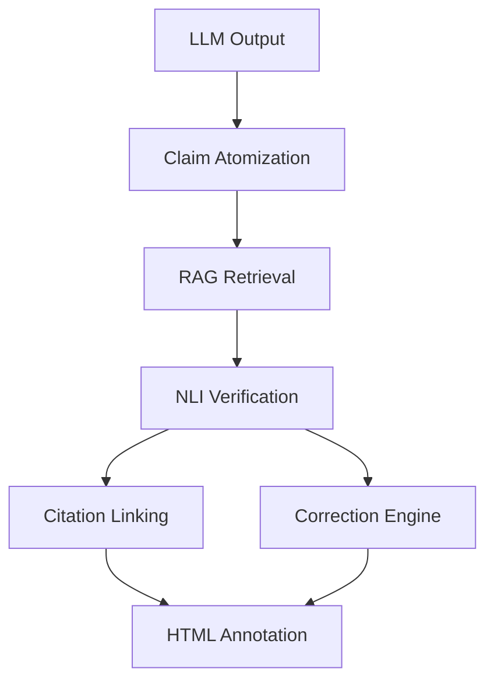
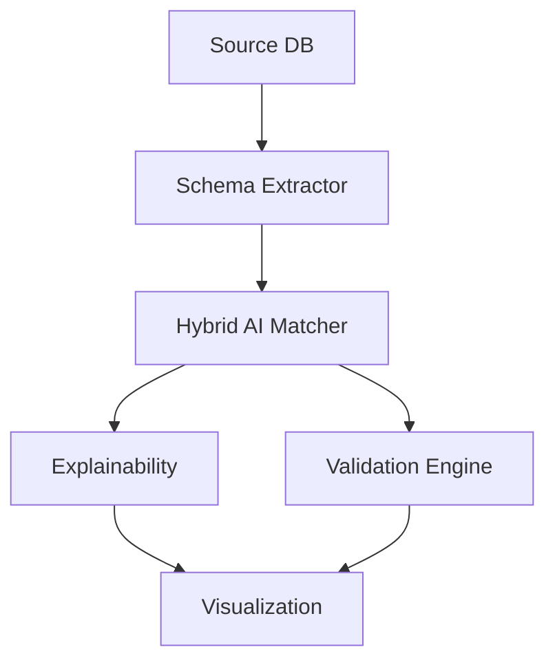

# DataForge Finals Solutions


This repository contains solutions for two tracks of the IITR ESummit DataForge Hackathon:

- **Track 1 (PS1): Hallucination Hunter** — Automated fact-checking and citation system for LLM-generated content.
- **Track 2 (PS2): Hybrid AI Engine for Enterprise Data Migration** — AI-powered schema mapping, explainability, and validation for enterprise database migration.

---

## Motivation & Use Cases

**Track 1:**
> Large Language Models (LLMs) often generate content with factual errors or hallucinations. Hallucination Hunter automates fact-checking, citation linking, and correction suggestions for LLM outputs, making them trustworthy for medical, legal, and enterprise use.

**Track 2:**
> Migrating enterprise databases is complex and error-prone. The Hybrid AI Engine automates schema mapping, explains decisions, and validates migrated data, reducing manual effort and risk.

---

# Track 1: Hallucination Hunter 🔍

An automated fact-checking and citation system for LLM-generated content. Detects hallucinations, provides source citations, and suggests corrections using RAG + NLI.

## 🚀 Quick Start (Track 1)

### Folder Navigation
- Backend code: `PS1 FINAL BE/p1 df/core/`
- Demos: `PS1 FINAL BE/p1 df/demos/`
- Utilities: `PS1 FINAL BE/p1 df/utils/`
- Test scripts: `PS1 FINAL BE/p1 df/tests/`

### Demo Instructions
Run a demo script for a quick test:
```bash
python PS1 FINAL BE/p1 df/demos/demo.py
```
Sample output will be generated in the `demo_results.json` file.

### 1. Install Dependencies

```bash
pip install -r requirements.txt
```

**Note**: If you encounter build errors on Windows, use:
```bash
pip install --only-binary :all: sentence-transformers chromadb transformers torch
```

### 2. Run the Complete Pipeline

```bash
python pipeline.py
```

This will:
1. Load the ML models (sentence-transformers + NLI)
2. Ingest source documents into the vector database
3. Verify your LLM-generated text
4. Generate an annotated HTML report

### 3. Start the API Server

```bash
python api.py
```

Then open `http://localhost:8000/docs` for the interactive API documentation.

## 📁 Project Structure (Track 1)

PS1 FINAL BE/p1 df/core/
├── ingestion.py           # PDF extraction & claim atomization
├── embedding_engine.py    # ChromaDB + sentence-transformers
├── claim_verifier.py      # NLI-based verification
├── citation_linker.py     # Citation generation & HTML annotation
├── correction_engine.py   # Hallucination correction suggestions
├── api.py                 # FastAPI backend
├── pipeline.py            # End-to-end CLI pipeline
└── requirements.txt       # Python dependencies



## 🧠 ML Models Used (Track 1)

1. **Embedding Model**: `all-MiniLM-L6-v2` (sentence-transformers)
   - Generates semantic embeddings for RAG retrieval
   - Fast and lightweight (<100MB)

2. **NLI Model**: `microsoft/deberta-v3-base-mnli`
   - Classifies claims as entailment/contradiction/neutral
   - State-of-the-art accuracy on MNLI

3. **Claim Atomization**: spaCy `en_core_web_sm`
   - Dependency parsing for claim extraction

## 🔧 Backend API Endpoints (Track 1)

### `POST /upload-source`
Upload a PDF source document to the knowledge base.

**Request**: Multipart form with PDF file

**Response**:
```json
{
  "status": "success",
  "filename": "medical_guidelines.pdf",
  "chunks_ingested": 42
}
```

### `POST /verify`
Verify LLM-generated text against source documents.

**Request**:
```json
{
  "llm_text": "The patient has Type 2 Diabetes..."
}
```

**Response**:
```json
{
  "job_id": "a3b2c1d4",
  "trust_score": 0.85,
  "statistics": {
    "total": 5,
    "supported": 4,
    "contradicted": 1,
    "unverifiable": 0
  },
  "claims": [...],
  "citations": [...],
  "corrections": [...]
}
```

### `GET /results/{job_id}`
Retrieve verification results for a job.

### `GET /evidence/{claim_index}?job_id={job_id}`
Get detailed evidence for a specific claim.

## 🎯 Key Features (Track 1)

### 1. **Claim Verification**
- Atomic claim decomposition
- RAG-based retrieval of relevant passages
- NLI model classifies: Supported / Contradicted / Unverifiable

### 2. **Citation Linking**
- Maps each claim to exact source passages
- Includes page numbers and confidence scores
- Generates formatted footnotes

### 3. **Hallucination Detection**
- Identifies contradictions with source documents
- Provides evidence for contradictions
- Suggests corrections based on source text

### 4. **Trust Scoring**
- Overall document trust score (0-1)
- Weighted by claim importance and confidence
- Penalizes contradictions heavily

### 5. **HTML Annotation**
- Color-coded claims:
  - 🟢 Green = Supported
  - 🔴 Red = Contradicted
  - 🟡 Yellow = Unverifiable
- Inline citation markers
- Hover tooltips with explanations

## 📊 Example Output (Track 1)

### Demo Output
```
{
  "job_id": "demo123",
  "trust_score": 0.92,
  "claims": ["Claim 1", "Claim 2"],
  "citations": ["Source 1", "Source 2"],
  "corrections": ["Correction 1"]
}
```

---

# Track 2: Hybrid AI Engine for Enterprise Data Migration 🏢

## Motivation & Use Cases
> Enterprise data migration requires accurate schema mapping and validation. This solution leverages AI to automate, explain, and visualize the migration process, ensuring data integrity and transparency.

## 🚀 Quick Start (Track 2)

### Folder Navigation
- Backend code: `PS2/src/`
- Main scripts: `PS2/`
- Frontend UI: `PS2/frontend/`
- Sample data: `PS2/data/`

### 1. Install Dependencies

```bash
pip install -r PS2/requirements.txt
```

### 2. Run Main Application

```bash
python PS2/main.py
```

### 3. Explore Features
- Schema extraction: `python PS2/schema_extractor.py`
- Hybrid AI matching: `python PS2/semantic_matcher.py`
- Explainability: `python PS2/explainability.py`
- Validation: `python PS2/validation_engine.py`

## 📁 Project Structure (Track 2)

PS2/
├── main.py                # Entry point for migration workflow
├── schema_extractor.py    # Extracts DB schema
├── semantic_matcher.py    # Hybrid AI schema matching
├── explainability.py      # Explains mapping decisions
├── validation_engine.py   # Validates migrated data
├── visualization.py       # Visualizes migration results
├── requirements.txt       # Python dependencies
├── data/                  # Sample and enterprise data
├── frontend/              # UI for migration workflow



## 🎯 Key Features (Track 2)

1. **Schema Extraction**: Automated extraction of database schema from source and target.
2. **Hybrid AI Matching**: Combines rule-based and ML approaches for accurate schema mapping.
3. **Explainability**: Provides transparent explanations for mapping decisions.
4. **Validation**: Ensures correctness and integrity of migrated data.
5. **Visualization**: Interactive UI for migration progress and results.

### Demo Instructions
Run a minimal test:
```bash
python PS2/minimal_test.py
```
Sample output will be printed to the console and can be visualized in the UI (`PS2/frontend/`).

---

For detailed instructions and demos, see the respective folders and scripts for each track.
